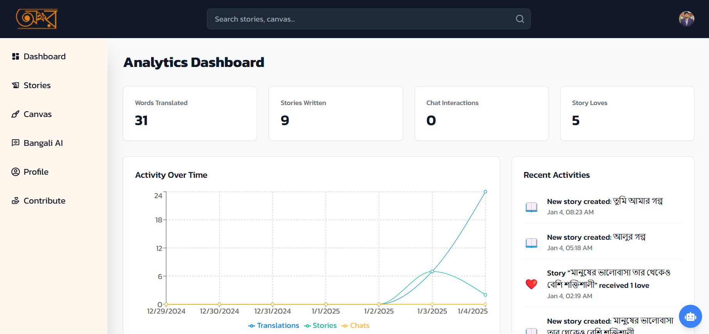
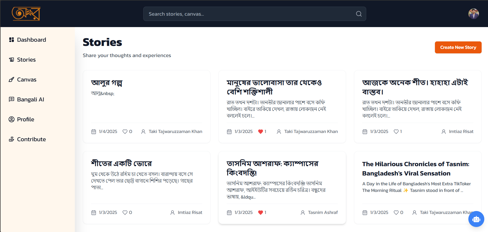
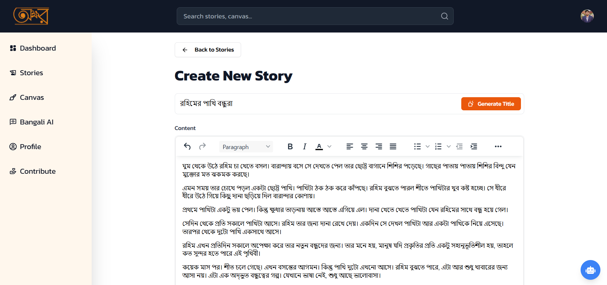
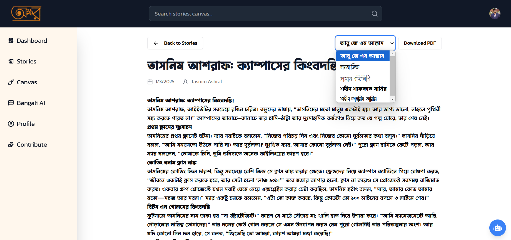
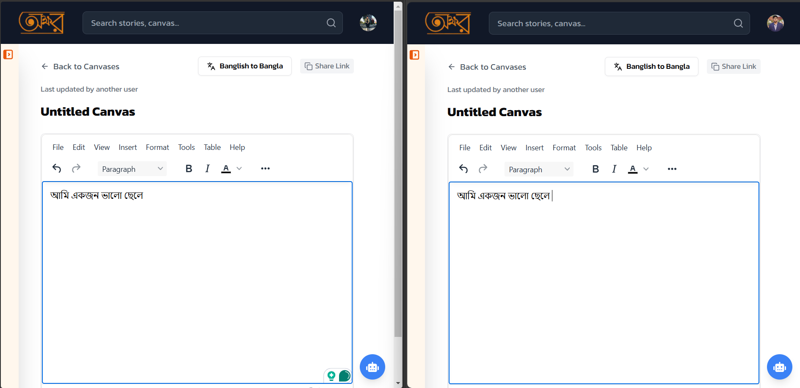
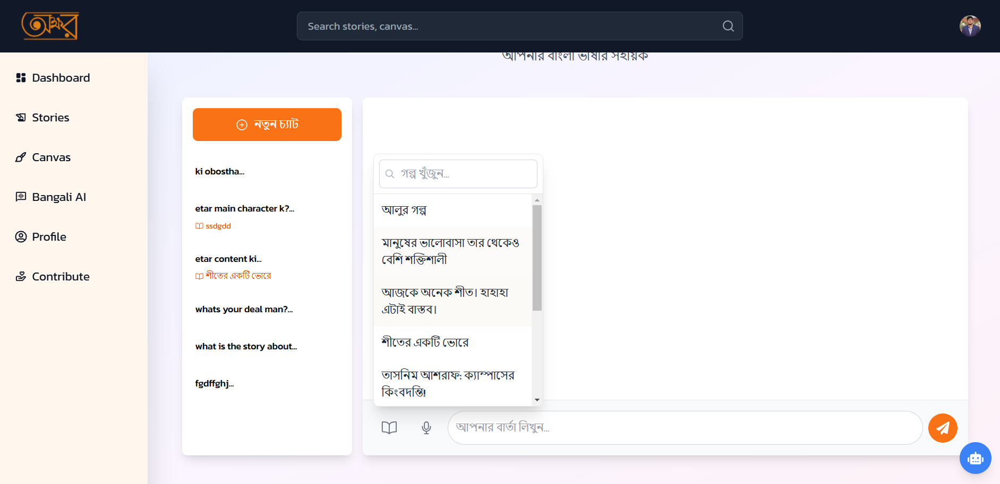
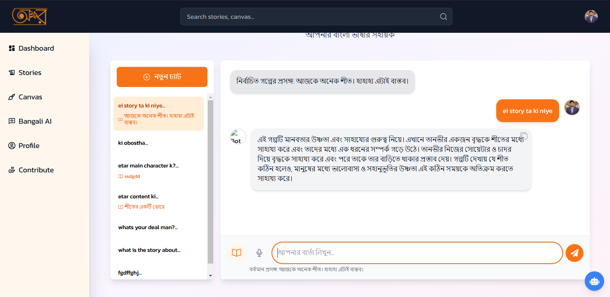
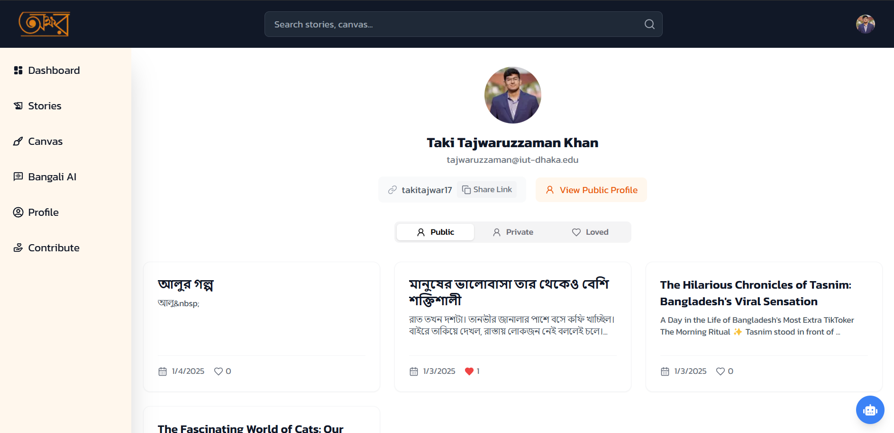

# অক্ষর (Okkhor)

<div align="center">

[](https://nextjs.org/)
[](https://reactjs.org/)
[](https://www.mongodb.com/)
[](https://tailwindcss.com)
[](https://openai.com)
[](https://www.docker.com/)

<br />


### 🎯 AI-Powered Bengali Learning Platform

[Demo](https://okkhor.vercel.app) · [Report Bug](https://github.com/takitajwar17/KUET-BitFest2025-Hackathon-XtraDrill/issues) · [Request Feature](https://github.com/takitajwar17/KUET-BitFest2025-Hackathon-XtraDrill/issues)


</div>

## 🌟 Overview

**অক্ষর (Okkhor)** is a revolutionary AI-powered learning platform developed by Team XtraDrill that bridges the gap in Bengali language education. By combining cutting-edge AI technologies with interactive learning experiences, we're making education more accessible and engaging for Bengali speakers worldwide.

## ✨ Key Features

### 📍 Dashboard (`/dashboard`)
- Analytics dashboard with real-time metrics

- Key statistics:
  - Words translated
  - Stories written
  - Chat interactions
  - Story loves
- Interactive charts:
  - Activity timeline (translations, stories, chats)
  - Story length distribution
- Recent activity feed with icons and timestamps
- Responsive layout with grid system

### 📖 Stories (`/stories`)
- Story management system with CRUD operations

- Real-time Bengali Transliteration:
  - Intelligent word-by-word transliteration
  - Space/punctuation-triggered conversion
  - Cursor position preservation
- Rich Text Editor Integration:

  - TinyMCE editor with Bengali support
  - Real-time content synchronization
  - Auto-save functionality
- Multiple Bengali Font Support:

  - আবু জে এম আক্কাস
  - চায়না তিস্তা
  - হাসান প্রতিলিপি
  - শহীদ শাফকাত সামির
  - শহীদ তাহমিদ তামিম
- Advanced PDF Export:
  - Custom font embedding
  - Multi-page support
  - High-resolution output (2x scale)
- Privacy Controls:
  - Public/Private story settings
  - Author attribution
  - Love/Like system

### 🎨 Canvas (`/canvas`)
- Real-time collaborative whiteboard
- TinyMCE rich text editor integration
- Auto-saving with debounced updates
- Multi-user editing via Pusher
- Version history tracking
- Bengali text optimization
- Translation integration
- Rich text formatting


### 🗣️ Bengali Chat (`/bengali-chat`)
- AI-powered Bengali language chatbot
- Native Bengali AI with gradient design
- Real-time responses
- User uploaded documents selection and querying



### 👤 Profile (`/profile`)

- User profile management
- Public/Private story management
- Story likes system
- Profile image support
- Email display
- Shareable profile links
- Story grid with:
  - Title and content preview
  - Creation date
  - Love count
  - Interactive hover effects
- Tabbed interface for story categories

## 🚀 Installation Guide

### Prerequisites

- Node.js 18+ and npm 9+
- MongoDB database
- Required API keys:
  - Clerk (Authentication)
  - OpenAI & GROQ (AI)
  - TinyMCE (Editor)
  - YouTube API
  - Pinecone (Vector DB)
  - Pusher (Real-time)

### 🖥️ Local Development

1. **Clone and Install**
```bash
git clone https://github.com/takitajwar17/KUET-BitFest2025-Hackathon-XtraDrill.git
cd KUET-BitFest2025-Hackathon-XtraDrill
npm install
```

2. **Setup Environment**
```bash
cp .env.example .env.local
# Edit .env.local with your API keys and credentials
```

3. **Start Development Server**
```bash
npm run dev
# Open http://localhost:3000
```

### 🐳 Docker Setup

```bash
docker pull takitajwar17/xtradrill
docker run -p 3000:3000 takitajwar17/xtradrill
# Open http://localhost:3000
```

### Troubleshooting

- **Environment**: Double-check API keys and MongoDB connection
- **Port Conflict**: Use `npm run dev -- -p 3001` for alternate port
- **Docker**: Check logs with `docker logs <container_id>`

## 🛠️ Tech Stack

### Frontend
- **Framework**: Next.js 15, React 18
- **Styling**: TailwindCSS, Framer Motion
- **Components**: Radix UI
- **State**: React Context

### Backend & Infrastructure
- **Runtime**: Node.js, Next.js API Routes
- **Database**: MongoDB with Mongoose
- **Auth**: Clerk
- **Real-time**: Pusher
- **Deployment**: Docker, Vercel
- **Analytics**: Vercel Analytics & Speed Insights

### AI/ML
- **Language Models**: OpenAI GPT-4
- **Speech**: Google Cloud Text-to-Speech
- **NLP**: GROQ SDK
- **Voice**: Web Speech API

## 📝 License

MIT License - see [LICENSE](LICENSE)

## 📬 Contact

Team XtraDrill - [@xtradrill](https://twitter.com/xtradrill)  
Project Link: [https://github.com/takitajwar17/KUET-BitFest2025-Hackathon-XtraDrill](https://github.com/takitajwar17/KUET-BitFest2025-Hackathon-XtraDrill)

---

<div align="center">
Made with ❤️ by Team XtraDrill for KUET BitFest 2025
</div>